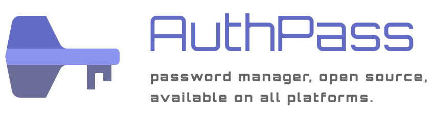
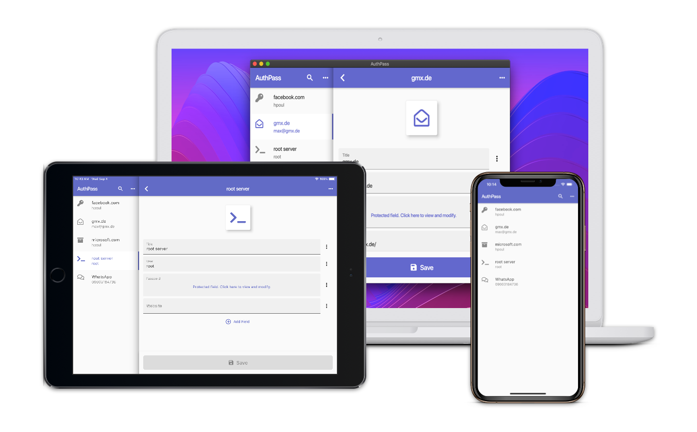

 

# AuthPass.app - Open Source Password Manager for mobile and desktop

AuthPass - Password Manager based on Flutter for all platforms. Keepass 2.x (kdbx 3.x) compatible.

* Mac Desktop: [Mac App Store](https://apps.apple.com/app/authpass-password-manager/id1478552452?ls=1&mt=12) or [check the releases](https://github.com/authpass/authpass/releases)
* Android: [Google Play Store](https://play.google.com/store/apps/details?id=design.codeux.authpass)
* iOS: [App Store](https://apps.apple.com/app/authpass-password-manager/id1479297675?ls=1&at=11l8ru)
* Linux Desktop: [Snapcraft Store](https://snapcraft.io/authpass), [Flathub flatpak](https://flathub.org/apps/details/app.authpass.AuthPass) [Check out our blog post for installation instructions](https://authpass.app/articles/linux-desktop-release-authpass-1.6.3/)
* Windows Desktop: [Microsoft Store](https://www.microsoft.com/store/apps/9P5N6ZNPSFBN?cid=readme) or [Windows Install Guide](https://authpass.app/docs/install/windows-installation/)
* Browser/Web: https://web.authpass.app/

